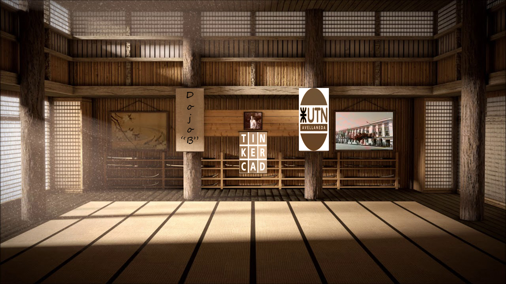
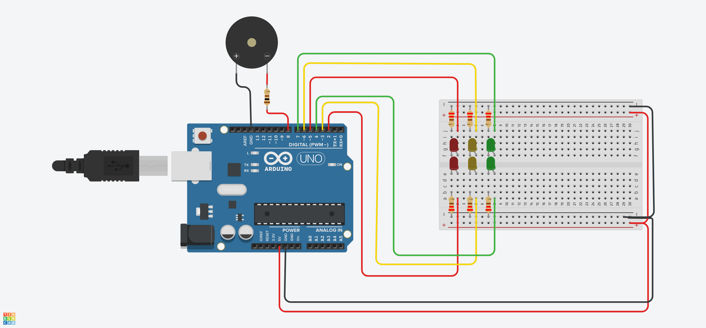

# SPD_Dojo1

## Integrantes 
- Belén Funtanillas
- Agustin Di Leone
- Lucas Da Silva Pinheiro
- Matias Cuervo
- Diego Uthurburu

## Proyecto: Semaforo.

## Descripción
Este semáforo se encarga de: 
- Encender la luz verde dura 5 segundos. 
- Encender la luz amarilla dura 3 segundos. 
- Encender la luz roja durante 5 segundos. 
- Tambien cuenta con señalización para personas no videntes como se detalla a  continuación. (Buzzer o piezo)
- Durante el rojo: Tiene que sonar 2 veces por segundo en un tono FUERTE. 

## Funciónes principales
Estas funciones se encargan de encender y apagar los leds.

LED_RED, LED_GREEN, LED_YELLOW, LED_RED_TWO, LED_GREEN_TWO,LED_YELLOW_TWO,
 SONIDO, son #define que utilizamos para agregar los leds y Piezo o Buzzer , asociandolo a pines de la placa arduino.

(Esta funcion se encarga de prender los Led del mismo color al mismo tiempo, pudiendo indicarle ademas la duracion )

~~~ C++ (lenguaje en el que esta escrito)
void prender(int ledUno, int ledDos, int tiempo)
{
	  digitalWrite(ledUno, HIGH);
  	digitalWrite(ledDos, HIGH);
  	delay(tiempo); 
}
~~~
  (Esta funcion se encarga de apagar los Led del mismo color al mismo tiempo)
~~~ C++ (lenguaje en el que esta escrito)
void apagar(int ledUno, int ledDos)
{
  	digitalWrite(ledDos, LOW);
  	digitalWrite(ledUno, LOW);
}
~~~

## :robot: Link a los proyectos

- Matias Cuervo [ver proyecto](https://www.tinkercad.com/things/hUqDE523LbC-copy-of-matias-cuervo-div-b-semaforo-ejercicio-2-4/editel?sharecode=P5kEAzCjxblsPSETMDQ9GASUqluOpppGvMuohfS_U7U)
- Lucas Da Silva Pinheerio [ver proyecto](https://www.tinkercad.com/things/iBjf3hSN7No-ingenious-duup-fyyran/editel?sharecode=wwDtCKYA-wOI_Ch89Un_-39zxF5PPr3qtg07N_nM-b0)
- Agustin Di Leone [ver proyecto](https://www.tinkercad.com/things/l4n1V6llKvx-semaforo-01-di-leone/editel?sharecode=GbTuu6yrYT2pgRAMrwOM_H_WSNBANoRJuEFpMjNwvNE)
- Belén Funtanillas [ver proyecto](https://www.tinkercad.com/things/8elnMYXZS2u-dojo-1-semaforo-funtanillas-belen/editel?sharecode=c0yHlJnpUMBMSqphn-GhbF5aRFUcmz5DdqbgSGJojPc)
- Diego Uthurburu [ver proyecto](https://www.tinkercad.com/things/hERyU7RJAFZ-copy-of-diego-uthurburu-1-b-ejercicio-2-4/editel?sharecode=beibGnl8a5IpPcm3uowNwMJTxRAjAAwKxU0ONaEomBA)

## :tv: Link al video del proceso
- [video](https://www.youtube.com/watch?v=VyGjE8kx-O0)

---
### Fuentes
- [Consejos para documentar](https://www.sohamkamani.com/how-to-write-good-documentation/#architecture-documentation).

- [Lenguaje Markdown](https://markdown.es/sintaxis-markdown/#linkauto).

- [Markdown Cheatsheet](https://github.com/adam-p/markdown-here/wiki/Markdown-Cheatsheet).

- [Tutorial](https://www.youtube.com/watch?v=oxaH9CFpeEE).

- [Emojis](https://gist.github.com/rxaviers/7360908).

---

